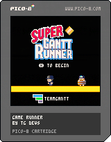
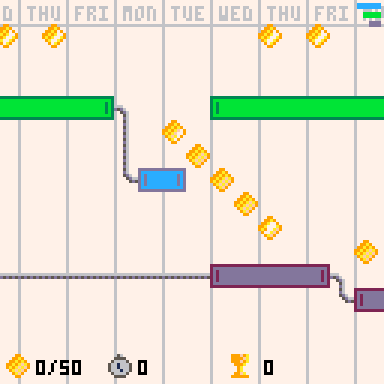
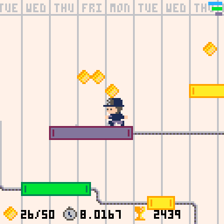

# Super Gantt Runner -

A tiny 8-bit style game by TeamGantt Engineering

## The Game

Help Lil John and Barrel Nathan nab those milestones as they reach the end of the projects.

[Play Super Gantt Runner](https://gantt-runner.netlify.app)

- **X** to Jump
- **Z** to Sprint
- **⬇️** + **X** to Super Jump
- ⬅️ or ➡️ to run

#### Features

- Pixel art!
- Two characters, each with unique attributes
- Gantt charts
- Milestone collection
- That "just one more try" speed run gameplay
- How fast can you get all the milestones?
- More gantt charts

#### FAQ

- What is this made with?
  - [Pico 8](https://www.lexaloffle.com/pico-8.php) - a wonderful little Fantasy Console
- Does it work on mobile?
  - Yes! Quite well. Try it on your phone for a gameboy-like experience.
- Why is Nathan in a barrel?
  - This is a mystery only solved by visiting the [Teamgantt website](https://www.teamgantt.com)

## Developing

1. Clone the repo (recommend cloning to your `Application Support/pico-8/carts/*` directory)
2. (In Pico-8) `load <path to p.8 file>`
3. (In VS Code or preferred editor) open `gantt-runner.p8`
4. Code away and hit `cmd+R` in Pico-8 console to restart game

## Exporting

See the [Pico-8 manual](https://www.lexaloffle.com/dl/docs/pico-8_manual.html) for all export options.

To build for web `export -f gantt_runner.html` will build in the current html folder in the repo.
