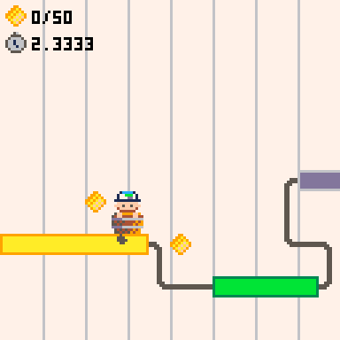

# Gantt Runner

A tiny game by TeamGantt Engineering

## Developing

1. Clone the repo (recommend cloning to your `Application Support/pico-8/carts/*` directory)
2. (In Pico-8) `load <path to p.8 file>`
3. (In VS Code or preferred editor) open `gantt-runner.p8`
4. Code away and hit `cmd+R` in Pico-8 console to restart game

## Exporting

See the [Pico-8 manual](https://www.lexaloffle.com/dl/docs/pico-8_manual.html) for all export options.

To build for web `export -f gantt_runner.html` will build in the current html folder in the repo.
